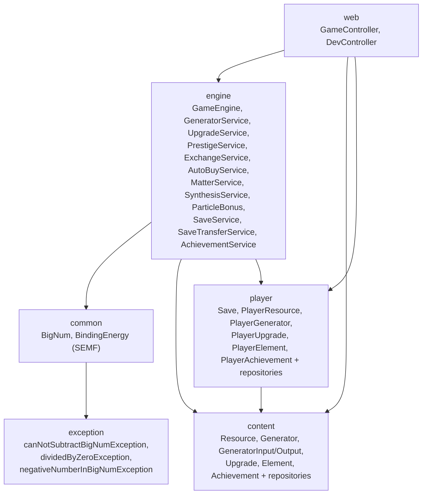

# CLAUDE.md — Periodic Idle: Browser Incremental Game

## 1. Опис проекту

Браузерна incremental (idle) гра на тематиці періодичної системи елементів. Гравець починає з абсолютної порожнечі, генерує енергію, обмінює її на субатомні частинки, синтезує атоми і врешті будує зірки.

### 🎯 Наукова концепція (основна ідея гри)

**Гра — це компресована, але фізично правдоподібна модель еволюції Всесвіту.** Єдине "умовне" припущення в усій грі — сам старт: Тір 0 ("Пустота") умовно відповідає квантовому вакууму до Великого вибуху, а момент, коли енергія впирається в `1e308` ("стіна нескінченності"), є ігровим еквівалентом Великого вибуху. **Після цього моменту прогресія гри повинна максимально відповідати реальній фізиці**, а не довільній фентезійній ескалації чисел — так, щоб науковець, граючи, впізнавав справжні фізичні закономірності, а не абстрактний grind.

Відповідність тірів реальним фізичним епохам:

| Тір гри | Реальний фізичний аналог |
|---------|---------------------------|
| Тір 0 — Пустота | Квантовий вакуум / інфляційна епоха до Великого вибуху |
| Стіна нескінченності (1e308 E) | **Умовний Великий вибух** — єдине довільне припущення гри |
| Тір 1 — Матерія (p/n/e) | Баріогенез і лептогенез — конденсація кварк-глюонної плазми в протони/нейтрони, народження електронів |
| Тір 2 — Атоми | Нуклеосинтез: первинний (Big Bang nucleosynthesis — H, He, слідовий Li) → зоряний (термоядерний синтез у зорях, C-N-O-цикл, аж до заліза-56) |
| Тір 3+ (майбутнє) | Молекули (хімічні зв'язки), зорі (головна послідовність, синтез важчих елементів через наднові/злиття нейтронних зірок — r-process), галактики, чорні діри |

Ключові фізичні принципи, яких мають дотримуватись усі майбутні механіки (не лише декоративно, а у формулах балансу):

- **Закон збереження енергії.** Перетворення ресурсу з одного тіру в інший (p+n+e → атом, атом+атом → молекула тощо) не повинно бути "безкоштовним" — воно має враховувати дефект маси/енергію зв'язку, як у реальній ядерній фізиці.
- **Крива питомої енергії зв'язку (binding energy curve).** Синтез елементів легших за залізо-56 екзотермічний (вивільняє енергію назад у E), синтез важчих за залізо — ендотермічний (вимагає чистих витрат енергії) — так само, як у зорях: чому термоядерний синтез живить зорю лише до заліза, а важчі елементи народжуються тільки в катастрофічних подіях (наднові, злиття нейтронних зірок).
- **Реалістична послідовність нуклеосинтезу**, а не довільний список: легкі елементи (H, He, трохи Li) — "дешеві" й доступні одразу після Великого вибуху; вуглець, кисень, залізо — потребують "зоряних" умов; елементи важчі за залізо — потребують екстремальних (катастрофічних) джерел енергії.
- **Освітня цінність понад ігрову зручність** — коли є вибір між "зручнішою для балансу" механікою і "фізично точнішою", перевага надається фізичній точності, якщо вона не ламає ключові цінності гри (Data-driven, довга гра, progressive disclosure).

Ця концепція — компас для розробки Тіру 2+ надалі: перш ніж додавати нову механіку чи ресурс, питання "чи так це працює у реальному Всесвіті?" має пріоритет над "чи так зручніше для балансу?".

```
┌──────────────────────────┐         ┌──────────────────────────┐
│     Браузер (тонкий)     │         │   Spring Boot (сервер)   │
│     HTML + vanilla JS    │         │   Авторитетний стан гри  │
│                          │         │                          │
│ • рендер стану           │  HTTP   │ • @Scheduled tick loop   │
│ • локальна інтерполяція  │◀──────▶│ • GameEngine (обрахунок) │
│ • кнопки дій             │  REST   │ • JPA + H2/PostgreSQL    │
│ • progressive disclosure │         │ • Flyway міграції         │
│ • іконки, анімації       │         │ • Swagger UI              │
└──────────────────────────┘         └──────────────────────────┘
```

### Git-workflow (вказівки розробника)

- **Пуш у remote — суворо заборонено.** Це робить тільки розробник.
- **Кожна нова фіча розробляється в новій гілці.** Claude (ші) може створювати гілку і переходити в неї сам.
- **Продовження роботи в уже існуючій гілці** (не нова фіча, а продовження задачі) — після кожного виконаного завдання (промту) ші **зобов'язана сама зробити коміт** (без пушу).
- **Щойно створена гілка під нову фічу** — стара поведінка лишається: ші лише **пропонує назву коміту**, а комітить розробник сам.
- **Граф залежностей (розділ 2) і структура репозиторію (розділ 3) повинні лишатись актуальними** — щоразу, коли зміна коду додає/видаляє/перейменовує модуль, клас чи зв'язок між компонентами, ші оновлює відповідні розділи цього файлу в тому ж коміті, а не залишає це "на потім".

### Ключові рішення (зафіксовані)

| Питання | Рішення |
|---------|---------|
| Бекенд | **Spring Boot 4.x + Java 21** — навчальна ціль + фундамент для майбутнього масштабування |
| БД розробки | **H2 file-based** — нуль установки, Flyway міграції |
| БД продакшену | **PostgreSQL** — перемикається через Spring profiles |
| Фронтенд | **Vanilla HTML + JS + CSS** — без фреймворків, Spring Boot роздає з `static/` |
| Великі числа | **BigNum (mantissa + exponent)** — кастомний клас, immutable, покритий тестами |
| Архітектура контенту | **Data-driven** — ресурси, генератори, апгрейди, елементи, рецепти, умови розблокування тірів визначаються рядками в БД, не кодом |
| Модель гравця | **Multi-save за client_token** — кожен браузер отримує власний ізольований save при першому зверненні |
| Деплой | **Railway** з автодеплоєм з GitHub |

### Ключові цінності
- **Data-driven** — новий контент = SQL-міграція, жодного нового Java-коду
- **Пасивний геймплей** — ніяких кліків, лише стратегічні рішення про розподіл ресурсів
- **Прогресія через порядки величини** — від 10⁻³⁰⁸ до нескінченності і далі
- **Progressive disclosure** — UI показує лише те, що гравець вже розблокував
- **Тестованість** — кожен сервіс покритий unit-тестами з Mockito
- **Довга гра** — баланс (V12+) розрахований на години/дні прогресії, не на 5-10хв

---

## 2. Граф залежностей



Односторонній потік залежностей: `web → engine → {common, content, player}`, `player → content` (FK-зв'язки на контент). `content` і `exception`/`common` не залежать від решти пакетів.

---

## 3. Структура репозиторію

```
periodic-idle/
├── pom.xml
├── CLAUDE.md                              # цей файл
├── docs/
│   └── balance.md                         # баланс генераторів/апгрейдів, ціль — довга гра
├── src/
│   ├── main/
│   │   ├── java/com/periodic/idle/
│   │   │   ├── PeriodicIdleApplication.java   # @SpringBootApplication + @EnableScheduling
│   │   │   │
│   │   │   ├── common/
│   │   │   │   ├── BigNum.java                # mantissa + exponent, immutable
│   │   │   │   └── BindingEnergy.java         # SEMF (Вайцзеккер): реальна енергія зв'язку ядра
│   │   │   │
│   │   │   ├── content/                       # правила гри (@Entity, read-only в runtime)
│   │   │   │   ├── Resource.java              # id, code, name, tier
│   │   │   │   ├── ResourceRepository.java
│   │   │   │   ├── Generator.java             # id, code, name, cost*, outputs, inputs
│   │   │   │   ├── GeneratorOutput.java       # generator → resource, ratePerLevel
│   │   │   │   ├── GeneratorInput.java        # generator → resource, ratePerLevel
│   │   │   │   ├── GeneratorRepository.java
│   │   │   │   ├── Upgrade.java               # id, code, effectType, effectValue, cost*, maxLevel
│   │   │   │   ├── UpgradeRepository.java
│   │   │   │   ├── Element.java               # Тір 2: атомний номер, символ, оболонки, рецепт p/n/e
│   │   │   │   ├── ElementRepository.java
│   │   │   │   ├── TierUnlockCondition.java   # tier → resource, minLog10 (OR-умова розблокування)
│   │   │   │   ├── TierUnlockConditionRepository.java
│   │   │   │   ├── Achievement.java           # code, conditionType, resource, threshold (data-driven)
│   │   │   │   └── AchievementRepository.java
│   │   │   │
│   │   │   ├── player/                        # мутабельний стан гравця
│   │   │   │   ├── Save.java                  # id, playerName, lastTick, brokenInfinity,
│   │   │   │   │                              # matterCollapses, autobuyEnabled, clientToken
│   │   │   │   ├── SaveRepository.java        # findByClientToken
│   │   │   │   ├── PlayerResource.java        # save → resource, number, exponent
│   │   │   │   ├── PlayerResourceRepository.java
│   │   │   │   ├── PlayerGenerator.java       # save → generator, level
│   │   │   │   ├── PlayerGeneratorRepository.java
│   │   │   │   ├── PlayerUpgrade.java         # save → upgrade, level
│   │   │   │   ├── PlayerUpgradeRepository.java
│   │   │   │   ├── PlayerElement.java         # save → element, count (скільки синтезовано)
│   │   │   │   ├── PlayerElementRepository.java
│   │   │   │   ├── PlayerAchievement.java     # save → achievement, unlockedAt
│   │   │   │   └── PlayerAchievementRepository.java
│   │   │   │
│   │   │   ├── engine/                        # ігрова логіка
│   │   │   │   ├── GameEngine.java            # @Scheduled tick, computeProduction, множники,
│   │   │   │   │                              # applyOfflineProgress (наздоганяючий прогрес)
│   │   │   │   ├── OfflineProgressRunner.java # ApplicationRunner: applyOfflineProgress на старті
│   │   │   │   ├── GeneratorService.java      # buy, buyBulk, buyAllMax, costMultiplier
│   │   │   │   ├── UpgradeService.java        # buy, buyBulk з валідацією
│   │   │   │   ├── PrestigeService.java       # prestige, hardReset, calcPotentialGain
│   │   │   │   ├── ExchangeService.java       # splitCrystals (VC → p, n, e)
│   │   │   │   ├── AutoBuyService.java        # @Scheduled автокупівля генераторів
│   │   │   │   ├── ParticleBonus.java         # пасивні бонуси Tier1-частинок до Tier0
│   │   │   │   ├── MatterService.java         # Тір 1: колапс матерії, Break Infinity
│   │   │   │   ├── SynthesisService.java      # Тір 2: синтез атомів з p/n/e
│   │   │   │   ├── SaveService.java           # findOrCreateByToken (ізольований save на браузер)
│   │   │   │   ├── SaveTransferService.java   # мануальний export/import save як JSON
│   │   │   │   └── AchievementService.java    # checkAndUnlock (на кожен /api/state), listWithStatus
│   │   │   │
│   │   │   ├── web/                           # REST API
│   │   │   │   ├── GameController.java        # /api/state, /api/buy-*, /api/prestige, /api/exchange,
│   │   │   │   │                              # /api/matter-*, /api/break-infinity, /api/stats,
│   │   │   │   │                              # /api/elements, /api/synthesize, /api/save-*,
│   │   │   │   │                              # /api/tier-unlocks, /api/achievements
│   │   │   │   └── DevController.java         # /api/dev/tick-speed, /api/dev/add-exp
│   │   │   │
│   │   │   └── exception/                     # кастомні винятки
│   │   │       ├── canNotSubtractBigNumException.java
│   │   │       ├── dividedByZeroException.java
│   │   │       └── negativeNumberInBigNumException.java
│   │   │
│   │   └── resources/
│   │       ├── application.yml                # H2 config, Flyway, JPA validate
│   │       ├── static/                        # фронтенд (Spring Boot роздає автоматично)
│   │       │   ├── index.html
│   │       │   ├── css/                       # розділено по логічних частинах (не один файл)
│   │       │   │   ├── base.css               # reset, .main/.panel, .page (спільна розмітка)
│   │       │   │   ├── nav.css                # сайдбар, sub-nav, мобільний drawer + їх @media
│   │       │   │   ├── resources.css          # ресурсна панель зверху, ∞-індикатор
│   │       │   │   ├── generators.css         # список генераторів, тулбар, autobuy-тоггл
│   │       │   │   ├── upgrades.css           # компас покращень + info-панель
│   │       │   │   ├── settings.css           # сторінка налаштувань, toggle switch
│   │       │   │   ├── matter.css             # Тір 1: колапс матерії + грейди/Break Infinity
│   │       │   │   ├── stats.css              # вкладка "Статистика"
│   │       │   │   ├── periodic-table.css     # Тір 2: таблиця + анімація орбіт
│   │       │   │   └── achievements.css       # сторінка досягнень (картки locked/unlocked)
│   │       │   ├── js/
│   │       │   │   ├── main.js                # точка входу: bootstrap токена, game loop
│   │       │   │   ├── config.js              # SAVE_ID, TIERS, TIER_UNLOCK_CONDITIONS, ICONS
│   │       │   │   ├── utils.js               # formatBigNum, resourceLog10, tier-unlock хелпери
│   │       │   │   ├── resources.js           # рендер верхньої панелі ресурсів
│   │       │   │   ├── generators.js          # вкладка генераторів, autobuy-toggle
│   │       │   │   ├── upgrades.js            # вкладка "компас" апгрейдів
│   │       │   │   ├── upgrade-info.js        # інфо-панель апгрейду, hover-buy
│   │       │   │   ├── matter.js              # Тір 1: колапс матерії + Break Infinity
│   │       │   │   ├── stats.js                # вкладка "Статистика" (/api/stats)
│   │       │   │   ├── periodic-table.js      # Тір 2: періодична таблиця + синтез
│   │       │   │   ├── achievements.js        # сторінка досягнень, /api/achievements
│   │       │   │   ├── nav.js                 # сайдбар/tier-навігація, fetchTierUnlocks, openAchievements
│   │       │   │   └── dev.js                 # dev-інструменти (tick speed, add exp) + save export/import
│   │       │   └── img/                       # іконки ресурсів і генераторів
│   │       │
│   │       └── db/migration/                  # Flyway SQL
│   │           ├── V1__initial_schema.sql
│   │           ├── V2__seed_void_tier.sql
│   │           ├── V3__player_state.sql
│   │           ├── V4__upgrades.sql
│   │           ├── V5__more_generators.sql
│   │           ├── V6__core_and_upgrades.sql
│   │           ├── V7__balance_tuning.sql
│   │           ├── V8__pow_cap_and_starter.sql
│   │           ├── V9__matter_tier.sql
│   │           ├── V10__save_matter_flags.sql
│   │           ├── V11__periodic_table.sql
│   │           ├── V12__long_game_balance.sql
│   │           ├── V13__tier_unlock_conditions.sql
│   │           └── V14__achievements.sql
│   │
│   └── test/java/com/periodic/idle/
│       ├── BigNumTest.java
│       ├── PeriodicIdleApplicationTests.java
│       ├── common/
│       │   └── BindingEnergyTest.java
│       ├── engine/
│       │   ├── GameEngineTest.java
│       │   ├── GeneratorServiceTest.java
│       │   ├── UpgradeServiceTest.java
│       │   ├── ExchangeServiceTest.java
│       │   ├── PrestigeServiceTest.java
│       │   ├── AutoBuyServiceTest.java
│       │   ├── ParticleBonusTest.java
│       │   ├── MatterServiceTest.java
│       │   ├── SynthesisServiceTest.java
│       │   ├── SaveServiceTest.java
│       │   ├── SaveTransferServiceTest.java
│       │   └── AchievementServiceTest.java
│       └── web/
│           └── GameControllerTest.java
```

---

## 4. Технологічний стек

| Компонент | Інструмент | Обґрунтування |
|-----------|------------|---------------|
| Мова | Java 21 | LTS, навчальна ціль |
| Фреймворк | Spring Boot 4.x | REST, DI, @Scheduled, JPA — все в одному |
| ORM | Spring Data JPA + Hibernate | @Entity → таблиця, JpaRepository → автоматичні запити |
| БД dev | H2 (file mode) | Вбудована, нуль конфігурації |
| БД prod | PostgreSQL | Перемикається через profile |
| Міграції | Flyway | Версіонована схема, seed-дані в SQL |
| Тести | JUnit 5 + Mockito + MockMvc | Unit + інтеграційні |
| API docs | springdoc-openapi (Swagger UI) | Інтерактивна документація на `/swagger-ui.html` |
| Збірка | Maven | Стандарт |
| Фронтенд | HTML + vanilla JS + CSS | Без npm/webpack, Spring Boot роздає з `static/` |
| Деплой | Railway | Автодеплой з GitHub push |
| Великі числа | BigNum (кастомний) | mantissa + exponent, immutable |

---

## 5. Правила роботи для Claude Code

### 5.1 Загальні правила

- **Один крок за раз.** Не виконуй наступний крок без явної команди.
- **Не змінюй код попередніх кроків** без явного дозволу.
- **Жодних готових рішень без пояснення.** Андрій вчиться — пояснюй концепції, показуй сніпети, рев'юй його код. Не пиши повні файли замість нього, окрім випадків коли він явно просить.
- **Тести паралельно з кодом.** Жоден крок не завершений без тестів.

### 5.2 Тести та обробка помилок

- **`mvn test` зелений після кожного кроку.**
- **Unit-тести** — `@ExtendWith(MockitoExtension.class)`, `@Mock`, `@InjectMocks`, `ReflectionTestUtils` для entity без публічних конструкторів.
- **Інтеграційні тести контролерів** — `@SpringBootTest` + `@AutoConfigureMockMvc` + `@MockitoBean`.
- **Кастомні винятки** замість голих `RuntimeException` (поступово мігрувати).
- **Жодних мережевих викликів у тестах.**

### 5.3 База даних та міграції

- **Зміна моделі = нова Flyway-міграція.** Ніколи не правити вже застосовані `V*__*.sql`.
- **`spring.jpa.hibernate.ddl-auto=validate`** — Hibernate тільки перевіряє, Flyway створює.
- **Seed-дані (контент гри) в окремих міграціях** — `V2__seed_void_tier.sql`, `V5__more_generators.sql` тощо.
- **Якщо Flyway скаржиться на checksum** — видалити папку `data/` і перезапустити.

### 5.4 Git і коміти

- **Кожна фіча — окрема гілка:** `feature/controller-tests`, `feat/periodic-table`.
- **Conventional Commits:** `feat:`, `fix:`, `test:`, `refactor:`.
- **PR в main через GitHub.**
- Див. також «Git-workflow» у розділі 1 щодо того, хто саме комітить (ші чи розробник) залежно від контексту гілки.

### 5.5 Файли, які НЕ потрапляють у репозиторій

```
data/                    # H2 БД файли
target/                  # Maven збірка
.idea/                   # IntelliJ
*.iml
.env
logs/
.ua/                     # Understand-Anything knowledge-graph артефакти
```

---

## 6. Модель даних

### Контент (правила гри — read-only в runtime)

**`resources`** — будь-що, що має кількість.

| Поле | Тип | Опис |
|------|-----|------|
| id | BIGINT PK | |
| code | VARCHAR(20) UNIQUE | "E", "VC", "p", "n", "e" |
| name | VARCHAR(100) | "Енергія", "Кристал пустоти" |
| tier | INT | 0=пустота, 1=частинки, 2=атоми |

**`generator`** — виробничі одиниці.

| Поле | Тип | Опис |
|------|-----|------|
| id | BIGINT PK | |
| code | VARCHAR(50) UNIQUE | "void_gen", "quantum_loop" |
| name | VARCHAR(100) | |
| tier | INT | |
| cost_resource_id | FK → resources | за що купується |
| base_cost_number | DOUBLE | мантиса базової ціни |
| base_cost_exponent | BIGINT | експонента базової ціни |
| cost_multiplier | DOUBLE | множник ціни за рівень |

**`generator_outputs` / `generator_input`** — що генератор виробляє/споживає.

| Поле | Тип | Опис |
|------|-----|------|
| id | BIGINT PK | |
| generator_id | FK → generator | |
| resource_id | FK → resources | |
| rate_per_level | DOUBLE | одиниць за секунду за рівень |

**`upgrades`** — покращення з різними типами ефектів.

| Поле | Тип | Опис |
|------|-----|------|
| id | BIGINT PK | |
| code | VARCHAR(50) UNIQUE | |
| name, description | VARCHAR | |
| tier | INT | |
| effect_type | VARCHAR(50) | тип ефекту (див. нижче) |
| effect_value | DOUBLE | коефіцієнт ефекту |
| target_generator_id | FK → generator NULL | для GEN_SPECIFIC_MULT |
| cost_resource_id | FK → resources | |
| cost_number, cost_exponent | DOUBLE, BIGINT | ціна як BigNum |
| cost_multiplier | DOUBLE | множник ціни за рівень |
| max_level | INT | |
| unlock_core_tier | INT default 0 | потрібний рівень CORE для розблокування |
| required_upgrade_id | FK → upgrades NULL | залежність у дереві |

**`elements`** — Тір 2: хімічний елемент періодичної таблиці.

| Поле | Тип | Опис |
|------|-----|------|
| id | BIGINT PK | |
| atomic_number | INT UNIQUE | Z (1-36, H..Kr) |
| symbol | VARCHAR(3) UNIQUE | "H", "He", "V" |
| name | VARCHAR(50) | Українська назва |
| atomic_weight | DOUBLE | стандартна атомна маса |
| period, group_number | INT | позиція в таблиці |
| shell_config | VARCHAR(30) | CSV розподілу електронів по оболонках, напр. "2,8,11,2" |
| cost_protons, cost_neutrons, cost_electrons | BIGINT | рецепт синтезу |

### Стан гравця (мутабельний)

**`saves`** — слот збереження.

| Поле | Тип |
|------|-----|
| id | BIGINT PK |
| player_name | VARCHAR(50) |
| last_tick | TIMESTAMP |
| broken_infinity | BOOLEAN |
| matter_collapses | BIGINT |
| autobuy_enabled | BOOLEAN |
| client_token | VARCHAR(64) UNIQUE |

**`player_resources`** — кількість ресурсу як BigNum.

| Поле | Тип |
|------|-----|
| id | BIGINT PK |
| save_id | FK → saves |
| resource_id | FK → resources |
| number | DOUBLE (mantissa) |
| exponent | BIGINT |

**`player_generators`** — рівень генератора.

| Поле | Тип |
|------|-----|
| id | BIGINT PK |
| save_id | FK → saves |
| generator_id | FK → generator |
| level | INT |

**`player_upgrades`** — рівень апгрейду.

| Поле | Тип |
|------|-----|
| id | BIGINT PK |
| save_id | FK → saves |
| upgrade_id | FK → upgrades |
| level | INT |

**`player_elements`** — скільки разів синтезовано кожен елемент.

| Поле | Тип |
|------|-----|
| id | BIGINT PK |
| save_id | FK → saves |
| element_id | FK → elements |
| count | BIGINT |

---

## 7. Ігрова логіка

### 7.1 Типи ефектів апгрейдів

| effect_type | Що робить | Формула |
|-------------|-----------|---------|
| `ENERGY_MULT` | Множник до всієї енергії | `1 + value * effective_level` (softcap після 20) |
| `GENERATOR_MULT` | Множник до всіх генераторів | `1 + value * level` |
| `COST_SCALE_REDUCE` | Зменшення cost_multiplier генераторів | `max(1.03, baseMult - value * level)` |
| `CRYSTAL_GAIN` | Множник до кількості кристалів при престижі | `1 + value * level` |
| `CORE` | Буст від кількості кристалів | `10^(level * value * log10(VC))` |
| `GEN_SPECIFIC_MULT` | Індивідуальний буст генераторів | за позицією + рівнем |
| `GEN_STACK` | Рівень генератора як множник | `stack = gen.level` для перших N генів |
| `ENERGY_POW` | Піднесення rate в степінь | `rate^(1 + value * level)`, тільки якщо rate > 1 |
| `PHANTOM_GEN` | Фантомні копії генераторів | `rate *= (1 + bonus)`, покриває 2*T генів |
| `AUTOBUY` | Автокупівля генераторів | перші N генів купуються щосекунди |

Пасивні бонуси Тіру 1 (не апгрейди, а функція накопичених частинок — `ParticleBonus`):

| Частинка | Ефект | Формула |
|----------|-------|---------|
| Протон (p) | + до енергомножника | `1 + count(p) * 0.25` |
| Нейтрон (n) | − до cost-mult генераторів | `count(n) * 0.02` |
| Електрон (e) | + до множника кристалів при престижі | `1 + count(e) * 0.15` |

### 7.2 Tick loop (GameEngine)

Кожні 100мс:
1. Для кожного `Save` — `computeProduction(saveId)`
2. Збір усіх множників (energy, generator, core, specific, stack, phantom, pow, ParticleBonus)
3. Для кожного `PlayerGenerator` з `level > 0`:
   - `rate = ratePerLevel * level * genMult * energyMult * coreBoost * protonMult * perGen * stack`
   - Якщо phantom > 0: `rate *= (1 + phantom)`
   - Якщо energyPow ≠ 1 і rate > 1: `rate = rate^energyPow`
4. Додати `rate * dt * tickSpeedMultiplier` до відповідного `PlayerResource` через `BigNum.add()`
5. Кап енергії на `1e308` (`GameEngine.ENERGY_CAP_EXPONENT`), знімається прапором `save.brokenInfinity`
6. Захист від NaN/Infinity — пропустити, не зламати стан

### 7.3 Офлайн-прогрес (GameEngine.applyOfflineProgress)

Сервер тікає для всіх saves у БД безперервно, поки процес живий — тому "офлайн" тут означає не закриту вкладку браузера (сервер все одно продовжує рахувати), а час, поки був вимкнений сам сервер (деплой, рестарт, крах).

`OfflineProgressRunner` (`ApplicationRunner`) викликає `applyOfflineProgress()` один раз одразу при старті застосунку:
1. Для кожного `Save` рахує `dt = now - lastTick` (реальний, не фіксований 100мс)
2. Якщо `dt < OFFLINE_MIN_SECONDS` (2с) — пропускає (це не простій, а звичайний рестарт у межах тіку)
3. Інакше — `dt` обрізається до `OFFLINE_MAX_SECONDS` (24 години), і викликається та сама формула виробництва, що й у звичайному тіку, але з реальним `dt` замість `TICK_INTERVAL_SEC`
4. `lastTick` виставляється на `now`

Звичайний `@Scheduled` тік (7.2) і далі завжди рахує фіксовані 100мс — офлайн-прогрес це окремий одноразовий виклик, який не змінює поведінку регулярного тіку.

### 7.4 Престиж (PrestigeService)

Формула кристалів пустоти (константи в `PrestigeService`, з V12 — довга гра):
```
log10Energy = exponent + log10(number)
якщо < PRESTIGE_MIN_LOG10_ENERGY (25.0) → 0 кристалів
base_log10 = (log10Energy - 25.0) / PRESTIGE_DIVISOR (3.0) + 1
crystals = 10^(base_log10 + log10(crystalGainMult * electronCrystalMult))
```

При престижі: енергія → стартова (10), кристали додаються, генератори скидаються до 0, апгрейди залишаються.

### 7.5 Обмін (ExchangeService)

Розщеплення кристалів: 1 VC → 1p + 1n + 1e. Дискретна дія, не генерація. Hard cap 1M за раз.

### 7.6 Колапс матерії і Break Infinity (MatterService)

- **Колапс матерії:** вимагає енергію на капі (`1e308`); скидає Тір 0 (енергію й рівні генераторів) і дає +1 обраної частинки (p/n/e). Повторювана дія, інкрементує `save.matterCollapses`.
- **Break Infinity:** одноразова дія, доступна коли `matterCollapses >= MatterService.BREAK_INFINITY_REQUIRED` (10). Знімає кап `1e308` (`save.brokenInfinity = true`).

### 7.7 Синтез атомів (SynthesisService)

Рецепт: `cost_protons = Z`, `cost_electrons = Z`, `cost_neutrons = mass_number(найпоширенішого ізотопу) - Z`. Приклади: H = 1p+0n+1e, He = 2p+2n+2e. Прогресія послідовна — елемент Z доступний для синтезу лише якщо елемент Z-1 вже синтезовано хоча б раз. `synthesizeBulk(amount=-1)` синтезує максимум за наявні частинки й енергію.

**Наукова концепція — первинний vs зоряний нуклеосинтез:**
- **Z ≤ `PRIMORDIAL_MAX_ATOMIC_NUMBER` (3, H/He/Li) — первинний нуклеосинтез**, доступний одразу без додаткових умов (як і первинному Всесвіту вистачило лічених хвилин розширення й охолодження на ці три елементи).
- **Z ≥ 4 (Be і далі) — зоряний нуклеосинтез (C-N-O-цикл)**, вимагає "запаленої зорі": `heliumCount(saveId) >= STELLAR_IGNITION_HELIUM_COUNT` (1000, накопичене гелієве "паливо" — умовний поріг критичної маси протозорі). Без цього `synthesizeBulk` кидає помилку з поясненням; `/api/elements` віддає `requiresStar`/`stellarIgnited`/`lockedReason` для UI (periodic-table.js показує причину блокування замість generic "ще не відкрито").

**Наукова концепція — енергія зв'язку ядра ({@link BindingEnergy}, SEMF/Вайцзеккер):**
- `massNumber = costProtons + costNeutrons`, `bindingEnergyMeV = BindingEnergy.totalMeV(Z, massNumber)` — справжня фізична формула, не хардкод-таблиця.
- **Z ≤ 26 (до заліза-56 включно) — екзотермічно**: синтез повертає енергію в E (`addEnergyRespectingCap`, поважає кап `1e308`, як `GameEngine.processSave`). Мімікрує термоядерний синтез у зорі — живить сам себе аж до заліза.
- **Z > 26 (важче за залізо) — ендотермічно**: синтез вимагає й списує E. Мімікрує r-process у наднових/злитті нейтронних зірок — важкі елементи не даються "безкоштовно".
- Переведення МеВ → ігрові одиниці E: `BigNum(meV, ENERGY_SCALE_EXPONENT=298)` — перший прохід масштабу (як V12-баланс), потребує живого тестування, див. `docs/balance.md`.
- Кількість атомів для ендотермічних елементів додатково обмежена наявною енергією (`maxAffordableByEnergy`, дзеркалить `wholeAmount`) — так само, як бракує частинок, може забракнути й енергії.
- `/api/elements/{saveId}` віддає `bindingEnergyMeV`/`exothermic` для кожного елемента — фронтенд (`element-detail-energy` у periodic-table.js) показує гравцеві реальну фізику перед синтезом.

### 7.8 Досягнення (AchievementService)

Data-driven, одноразові умови над станом save (таблиця `achievements`, посіяна Flyway). `condition_type` визначає інтерпретацію `resource_id`/`threshold`:

| condition_type | Умова |
|-----------------|-------|
| `RESOURCE_LOG10` | `log10(number) + exponent >= threshold` для вказаного `resource_id` |
| `MATTER_COLLAPSES` | `save.matterCollapses >= threshold` |
| `ELEMENTS_SYNTHESIZED` | кількість елементів з `player_elements.count > 0` `>= threshold` |
| `BROKEN_INFINITY` | `save.brokenInfinity == true` (threshold ігнорується) |

`checkAndUnlock(saveId)` перевіряє лише ще не розблоковані досягнення й вставляє рядок у `player_achievements` (унікальний по `save_id + achievement_id`, дата фіксується). Викликається на кожному `/api/state` (кожні ~1.5с незалежно від активної вкладки) — це навмисно: короткочасний пік (напр. енергія прямо перед престижем) інакше міг би не встигнути зафіксуватись, якби перевірка була лише при відкритій вкладці "Досягнення". Окремий `GET /api/achievements/{saveId}` теж викликає перевірку і повертає повний список з прапором `unlocked`/`unlockedAt` для UI.

---

## 8. Тіри гри (ігровий дизайн)

### Tier 0 — Пустота (квантовий вакуум до Великого вибуху)
- **Ресурс:** Енергія (E)
- **Механіка:** генератори пустоти, апгрейди навколо Ядра (CORE)
- **Престиж:** Реінкарнація → скидає E і генератори, дає Кристали Пустоти (VC)
- **Кінець тіру:** досягнення `1e308` — "стіна нескінченності" = умовний Великий вибух (єдине довільне припущення гри, див. "Наукову концепцію" в розділі 1)

### Tier 1 — Матерія (баріогенез і лептогенез)
- **Розблоковується:** енергія сягає `1e308` (стіна нескінченності) АБО вже є частинки p/n/e
- **Ресурси:** Протони (p), Нейтрони (n), Електрони (e)
- **Механіка:** обмін VC → частинки (ExchangeService), Колапс матерії (MatterService) на стіні нескінченності
- **Break Infinity:** зняти кап `1e308` після 10 колапсів матерії
- **Частинки дають пасивні бонуси до Tier 0** (ParticleBonus), навіть без Break Infinity

### Tier 2 — Атоми (нуклеосинтез)
- **Розблоковується:** `log10(протонів) >= 3` (1000+ протонів)
- **Окрема вкладка:** періодична таблиця (елементи 1-36, H..Kr)
- **Механіка:** синтез p + n + e → атоми за рецептами (H=1p+1e, He=2p+2n+2e, ...), послідовна прогресія
- **Наукова точність:** синтез враховує реальну криву питомої енергії зв'язку ядра (SEMF/Вайцзеккер, `BindingEnergy`, розділ 7.7) — до заліза-56 екзотермічний (повертає E), важче за залізо — ендотермічний (коштує E). Нуклеосинтез розділений на первинний (H/He/Li, доступний одразу) і зоряний (Be і далі, вимагає "запаленої зорі" — 1000+ синтезованого He).
- **UI:** hover/клік на елемент показує модель Бора (оболонки з анімованими електронами), реальну енергію зв'язку (МеВ) і кнопку синтезу

### Tier 3+ — Молекули, зорі, чорні діри, мультивсесвіт (майбутнє)
Продовження нуклеосинтезу за науковою концепцією (розділ 1): молекули — хімічні зв'язки з атомів (H₂O, CH₄, NH₃, CO₂...); зорі — термоядерний синтез головної послідовності аж до заліза; важчі за залізо елементи вже й зараз ендотермічні (розділ 7.7), а надалі — окрема "катастрофічна" механіка (наднові, злиття нейтронних зірок, r-process) замість звичайного synthesis.

---

## 9. REST API

### Стан гри
| Method | Path | Опис |
|--------|------|------|
| GET | `/api/state/{saveId}` | Усі ресурси + ratePerSec |
| GET | `/api/generators/{saveId}` | Генератори з breakdown |
| GET | `/api/upgrades/{saveId}` | Апгрейди з поточним рівнем |
| GET | `/api/prestige-info/{saveId}` | Потенційний gain кристалів |
| GET | `/api/matter-info/{saveId}` | Прапори Тіру 1, частинки, готовність до колапсу |
| GET | `/api/stats/{saveId}` | Множники й per-generator розбивка |
| GET | `/api/elements/{saveId}` | Періодична таблиця з прапором `unlocked`/`count` |
| GET | `/api/tier-unlocks` | Data-driven умови розблокування тірів (без saveId — однакові для всіх) |
| GET | `/api/achievements/{saveId}` | Перевіряє і повертає список досягнень з прапором `unlocked`/`unlockedAt` |

### Дії гравця
| Method | Path | Body | Опис |
|--------|------|------|------|
| POST | `/api/buy-generator` | saveId, generatorId, amount | Купити генератор |
| POST | `/api/buy-generator-all` | saveId | Купити всі на макс |
| POST | `/api/buy-upgrade` | saveId, upgradeId, amount | Купити апгрейд |
| POST | `/api/prestige` | saveId | Виконати престиж |
| POST | `/api/reset` | saveId | Повний скид |
| POST | `/api/exchange/split` | saveId, amount | Розщепити кристали |
| POST | `/api/autobuy-toggle` | saveId, enabled? | Перемкнути автокупівлю |
| POST | `/api/matter-collapse` | saveId, particle | Колапс матерії (+1 частинки) |
| POST | `/api/break-infinity` | saveId | Зняти кап `1e308` |
| POST | `/api/synthesize` | saveId, elementId, amount | Синтезувати елемент |
| POST | `/api/save/init` | token | Отримати/створити save за client-token |
| GET | `/api/save-export/{saveId}` | — | Мануальний export save як JSON |
| POST | `/api/save-import` | saveId, data | Мануальний import save з JSON |

### Dev-інструменти
| Method | Path | Опис |
|--------|------|------|
| POST | `/api/dev/tick-speed` | Множник швидкості тіку |
| GET | `/api/dev/tick-speed` | Поточний множник |
| POST | `/api/dev/add-exp` | Додати експоненту до ресурсу |

Помилки бізнес-логіки повертають HTTP 400 з `{"error": "message"}`.

---

## 10. UI принципи

### Progressive disclosure
- Вкладки розблоковуються поступово через `TIER_UNLOCK_CONDITIONS` — data-driven, підвантажується з `/api/tier-unlocks` при bootstrap (`fetchTierUnlocks()` у nav.js), а не хардкодиться у JS
- Тір розблокований, якщо ХОЧА Б ОДНА його умова виконана (OR за рядками `tier_unlock_conditions` з однаковим `tier`) — напр. Тір 1 відкривається або стіною нескінченності (E ≥ 1e308), або вже наявною хоч однією частинкою p/n/e
- `locked` тір-кнопки в сайдбарі (`display:none`) знімають клас, коли `refreshTierLocks()` бачить виконану умову

### Сайдбар з тірами (не плоский ряд вкладок)
```
Тір 0 (Пустота)     Тір 1 (Матерія)      Тір 2 (Атоми)
  Генератори          Колапс               Таблиця
  Апгрейди            Грейди
  Престиж
  Статистика
```

### Ресурси завжди видно зверху
Горизонтальний рядок карток із іконкою, кількістю, і +rate/с. Оновлюється кожні 1.5с (`fetchState`).

### Періодична таблиця
Стандартна 18-колонкова сітка (по періодах/групах), картки з orange/red neon-акцентом. Hover/клік показує плаваючу картку з моделлю Бора — концентричні кільця обертаються навколо ядра (CSS keyframe-анімація, `prefers-reduced-motion` враховано).

---

## 11. Конфігурація

### application.yml
```yaml
spring:
  datasource:
    url: jdbc:h2:file:./data/periodic-idle
    username: sa
    password:
  h2:
    console:
      enabled: ${H2_CONSOLE_ENABLED:false}
  jpa:
    hibernate:
      ddl-auto: validate
  flyway:
    enabled: true
```

### Залежності (pom.xml)
- Spring Web, Spring Data JPA, Validation, Lombok, DevTools
- H2 Database, PostgreSQL Driver
- Flyway Migration
- springdoc-openapi-starter-webmvc-ui

---

## 12. Поточний стан

**Версія:** 0.4.0 (Tier 0-2 грабельні, довга гра)

**Реалізовано:**
- BigNum (mantissa + exponent) з повним покриттям тестами
- Content entities: Resource, Generator, GeneratorInput/Output, Upgrade, Element (+ репозиторії)
- Player entities: Save (multi-account, client_token), PlayerResource, PlayerGenerator, PlayerUpgrade, PlayerElement
- GameEngine з @Scheduled tick (100ms): ENERGY_MULT, GENERATOR_MULT, CORE, GEN_SPECIFIC_MULT, GEN_STACK, ENERGY_POW, PHANTOM_GEN, ParticleBonus
- OfflineProgressRunner: наздоганяючий прогрес на старті сервера (реальний dt від lastTick, кап 24h)
- GeneratorService, UpgradeService, PrestigeService, ExchangeService, AutoBuyService
- MatterService: колапс матерії + Break Infinity (Тір 1)
- SynthesisService: синтез атомів 1-36 з послідовною прогресією (Тір 2), реальна енергія зв'язку ядра (SEMF) — екзо-/ендотермічно відносно заліза-56, первинний vs зоряний нуклеосинтез (гейт "запаленої зорі")
- TierUnlockCondition: data-driven умови розблокування тірів (OR за рядками), фронтенд без хардкоду
- AchievementService: 15 data-driven досягнень (RESOURCE_LOG10, MATTER_COLLAPSES, ELEMENTS_SYNTHESIZED, BROKEN_INFINITY), перевірка на кожен /api/state
- SaveService: ізольований save на кожен client_token (справжній multi-account)
- SaveTransferService: мануальний export/import save як JSON, з UI-кнопками в Settings
- GameController: повний REST API (стан, купівлі, престиж, обмін, матерія, статистика, елементи, save-transfer)
- DevController: tick-speed, add-exp
- Фронтенд: сайдбар/тіри, ресурси, генератори, апгрейди, престиж, колапс матерії, грейди/Break Infinity, статистика, періодична таблиця з анімованою моделлю Бора
- Flyway міграції V1-V14 (включно з довгограйним ребалансом, data-driven unlock conditions і досягненнями)
- Тести: 176+ passed

**Відомі прогалини:**
- Баланс V12 — перший прохід, не грано наживо; можливе подальше тонке налаштування (`docs/balance.md`)

---

## 13. План розробки — наступні кроки

| Крок | Тема | Статус |
|------|------|--------|
| ~~1~~ | ~~BigNum + unit тести~~ | ✅ |
| ~~2~~ | ~~JPA entities + Flyway~~ | ✅ |
| ~~3~~ | ~~Player state + repositories~~ | ✅ |
| ~~4~~ | ~~GameEngine tick + REST API~~ | ✅ |
| ~~5~~ | ~~Upgrades system~~ | ✅ |
| ~~6~~ | ~~Prestige + Exchange~~ | ✅ |
| ~~7~~ | ~~Frontend MVP~~ | ✅ |
| ~~8~~ | ~~Tests: 100+ passed~~ | ✅ |
| ~~9~~ | ~~Стіна нескінченності (e308 → Break Infinity)~~ | ✅ |
| ~~10~~ | ~~Tier 1: обмін VC → частинки з повним UI (колапс + грейди)~~ | ✅ |
| ~~11~~ | ~~Tier 2: періодична таблиця, синтез атомів~~ | ✅ |
| 12 | Баланс Tier 0 — перший прохід під довгу гру зроблено (V12), потрібне живе тестування | 🔶 |
| ~~13~~ | ~~Offline progress (наздоганяючий прогрес на старті сервера)~~ | ✅ |
| ~~14~~ | ~~Досягнення (achievements system)~~ | ✅ |
| ~~15~~ | ~~Unlock conditions (data-driven progressive disclosure)~~ | ✅ |
| ~~16~~ | ~~Збереження/завантаження (multiple saves за client_token)~~ | ✅ |
| ~~16b~~ | ~~Мануальний save export/import — UI-кнопки в Settings~~ | ✅ |
| 17 | Production PostgreSQL profile | ⏳ |
| 18 | Статистика гри (час гри, кількість престижів, тощо — частково є через /api/stats) | 🔶 |
| ~~20~~ | ~~Крива питомої енергії зв'язку в SynthesisService (екзо-/ендотермічний synthesis відносно заліза-56)~~ | ✅ |
| ~~21~~ | ~~Розділити нуклеосинтез на первинний (Big Bang: H/He/Li) і зоряний (C-N-O аж до заліза)~~ | ✅ |
| 19 | Tier 3: молекули (H₂O, CH₄, NH₃...) з атомів, енергія хімічного зв'язку | ⏳ |
| 22 | Tier 3+: зорі (головна послідовність), важкі елементи лише через наднові/r-process | ⏳ |

---

## 14. Конвенції

### 14.1 Код
- **Пакети:** `com.periodic.idle.{common, content, player, engine, web, exception}`
- **Content entities** — `@Getter`, `@NoArgsConstructor(access = PROTECTED)`, без сеттерів. Дані через Flyway.
- **Player entities** — `@Getter @Setter`, бо мутуються в runtime.
- **BigNum** — immutable, кожна операція повертає новий об'єкт.
- **Сервіси** — `@RequiredArgsConstructor`, DI через конструктор, `@Transactional` на мутуючих методах.

### 14.2 Data-driven принцип
Додавання нового ресурсу/генератора/апгрейду/елемента = **тільки SQL-міграція**:
1. Рядок у `resources`
2. Рядок у `generator` + рядки в `generator_outputs`/`generator_input`
3. Або рядок у `upgrades`
4. Або рядок у `elements`

**Жодного нового Java-коду.** Движок працює з абстракціями.

### 14.3 Іменування міграцій
```
V{N}__short_description.sql
V1__initial_schema.sql
V11__periodic_table.sql
V12__long_game_balance.sql
```

---

## 15. Можливі майбутні покращення

### Наукова точність (пріоритет — див. розділ 1 "Наукова концепція")
- ~~Крива питомої енергії зв'язку в SynthesisService~~ ✅ (BindingEnergy/SEMF, розділ 7.7)
- ~~Розділити нуклеосинтез на "первинний" і "зоряний"~~ ✅ (гейт "запаленої зорі" — 1000+ He, розділ 7.7)
- Молекули: H₂O, CH₄, NH₃, CO₂ — рецепти з атомів, з енергією хімічного зв'язку (значно менші порядки величини, ніж ядерна енергія зв'язку — реалістична різниця хімії й фізики)
- Елементи важчі за залізо (Z>26) — доступні лише через окрему "катастрофічну" механіку (наднова/злиття нейтронних зірок, r-process), не звичайний synthesis
- Зорі як генератори Tier 3 (споживають водень, виробляють гелій — головна послідовність)
- Чорні діри як престиж Tier 3+ (гравітаційний колапс)
- Мультивсесвіт / циклічна космологія як endgame (новий Великий вибух після теплової смерті)

### Технічне / UX
- WebSocket замість polling (реальний час без затримки)
- Подвійний логарифм для чисел > 10^(10^308) (OmegaNum-style)
- Локалізація (EN/UA)
- Mobile-responsive UI
- Leaderboard (опційно)
- Модульна система плагінів для контенту
- Sound effects / ambient music
